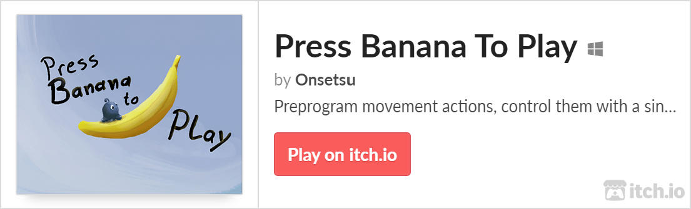
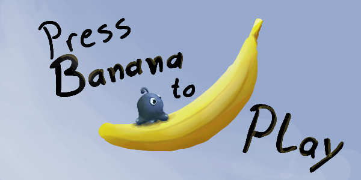
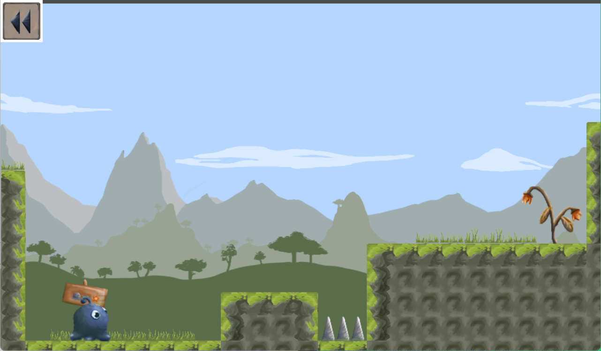
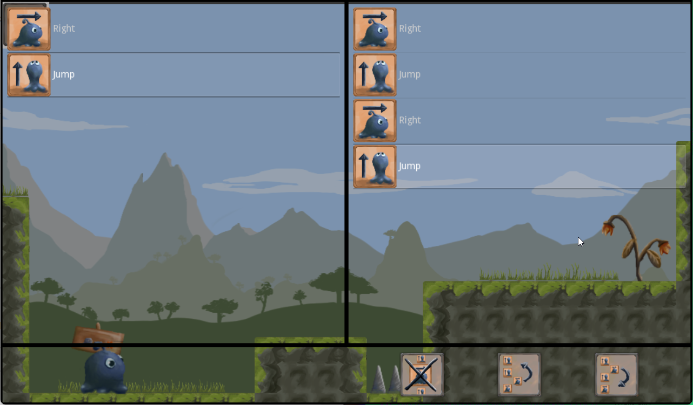
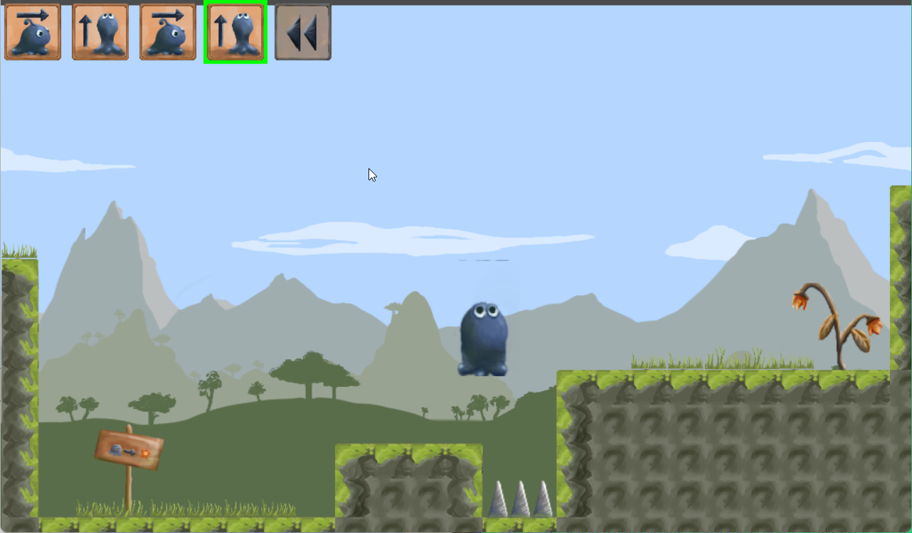

# Press Banana to Play

A **Precision-Puzzler** about a single button

 
 
 
 
 
 
 

<!-- ## Idea

 -->

Our entry to the [6th HPI GameJam](https://github.com/topics/hpigamejam06) on Alternative Input Methods. In Press Banana To Play, you control a blob using only a single button.

The GameJam version used a **physical banana** as your input method instead. Unfortunately, the banana is **not** included in this digital version!

## Goal
In Press Banana To Play, the goal for your watery blob is to reach the withering flower to make her bloom again.

However, your blob demands exact instructions on how to do so!

Your task is to create a list of actions for your blob to execute.

During planning double click an action on the left to add it to your action list.

You can adjust your action list by removing or reordering actions with the bottom-right buttons.

Once satisfied with your actions, it's time to execute them.

Time your predefined actions correctly to reach the end of the level. There is no going back.

## Controls

#### Planning

- Double Click - Add action to list
- Bottom-right Buttons - Delete or reorder selected action
- Space - Switch to executing

#### Executing

- Space - Press or hold to execute current action
